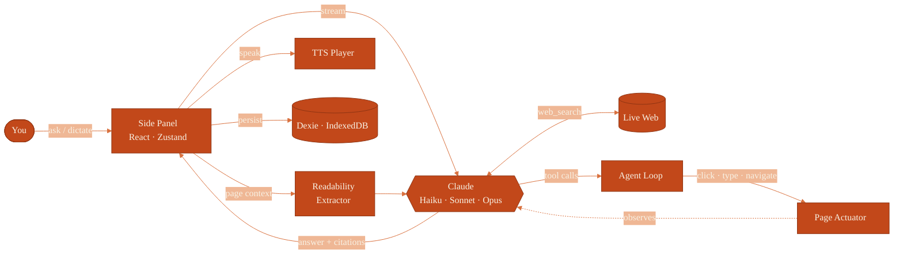

<!-- ============================ HEADER ============================ -->
<div align="center">


<br/>

### A calm AI companion in your Chrome side panel

Reads the page you're on · answers with live web search and citations · acts on pages for you · speaks aloud and listens — all on your own Anthropic key.

<br/>


&nbsp;

&nbsp;

&nbsp;

&nbsp;


<br/>

**Bring your own key** &nbsp;·&nbsp; No server &nbsp;·&nbsp; No account &nbsp;·&nbsp; No telemetry

</div>

<br/>

---

<br/>

> Nothing leaves your machine except calls to `api.anthropic.com` and `freetts.org`.
> Your API key lives in the extension's local storage — never synced, never sent anywhere else.

<br/>

<!-- ============================ CAPABILITIES ============================ -->
## What it does

<br/>

| Capability | How it works |
| :--- | :--- |
| **Reads the page** | Extracts clean, readable content from the active tab with Mozilla Readability — no copy-paste. |
| **Answers with citations** | Live web search built into the model, with inline sources you can click. |
| **Acts on pages for you** | An agent loop that can `click`, `type_text`, `scroll`, `navigate`, and manage tabs to finish a task. |
| **Speaks answers aloud** | Streams text-to-speech as it writes, with an offline fallback voice and quota-aware caching. |
| **Takes voice dictation** | Talk to it instead of typing — speech-to-text straight into the composer. |
| **Highlight to act** | Select any text on a page and fire a one-shot action from the right-click menu. |
| **Chooses its model** | Switch between Haiku 4.5, Sonnet 5, and Opus 4.8 per conversation. |
| **Tracks the cost** | Live token and cost accounting, so you always know what a thread is worth. |

<br/>

---

<br/>

<!-- ============================ ARCHITECTURE ============================ -->
## How a turn flows

<br/>



<br/>

Everything above runs locally in the extension. The only outbound calls are to Anthropic, for inference and search, and to the text-to-speech service.

<br/>

---

<br/>

<!-- ============================ QUICKSTART ============================ -->
## Getting started

**Prerequisites** — Node 20 or newer, Chrome 116 or newer.

<br/>

**1. Build the extension**

```sh
git clone https://github.com/GodSpeed-07/Briefly-AI.git
cd Briefly-AI
npm install
npm run build
```

<br/>

**2. Load it into Chrome**

```text
1.  Open  chrome://extensions
2.  Turn on  Developer mode  (top-right)
3.  Click  Load unpacked  and select the  dist/  folder
4.  The welcome tab opens — paste your Anthropic API key and click Verify
5.  Optionally allow the microphone for dictation, then click Open Briefly
```

<br/>

Get an API key at [console.anthropic.com/settings/keys](https://console.anthropic.com/settings/keys). Toggle the panel anytime with **`Alt + B`**.

<br/>

<details>
<summary><b>Developer commands</b></summary>

<br/>

```sh
npm run typecheck          # tsc --noEmit
npm test                   # vitest run
npm run build              # bundle side panel + content script
npm run icons              # regenerate PNGs from src/brand/icon.svg
npm run benchmark:context  # measure agent input-token usage
```

**Stack** — Vite · React 18 · TypeScript 5 · Zustand · Dexie (IndexedDB) · Vitest · Mozilla Readability · marked with DOMPurify.

</details>

<br/>

---

<br/>

<!-- ============================ FOOTER ============================ -->
<div align="center">

AI beside the page — not another tab, another login, or another data pipeline.

<br/>

[Star the repository](https://github.com/GodSpeed-07/Briefly-AI/stargazers) &nbsp;·&nbsp; [Report an issue](https://github.com/GodSpeed-07/Briefly-AI/issues)


</div>
